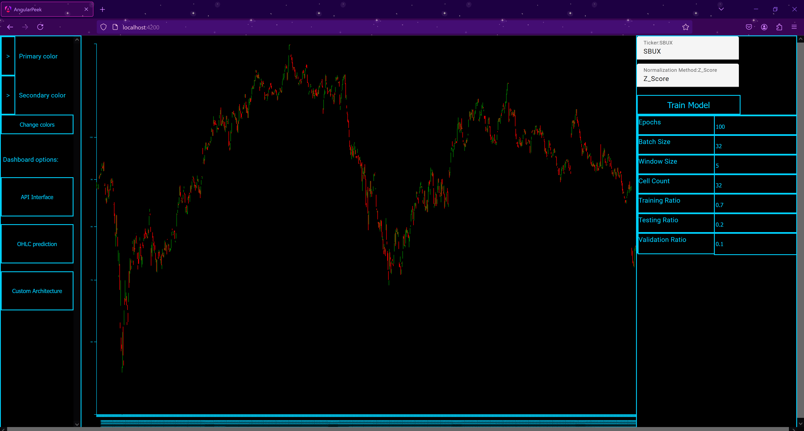
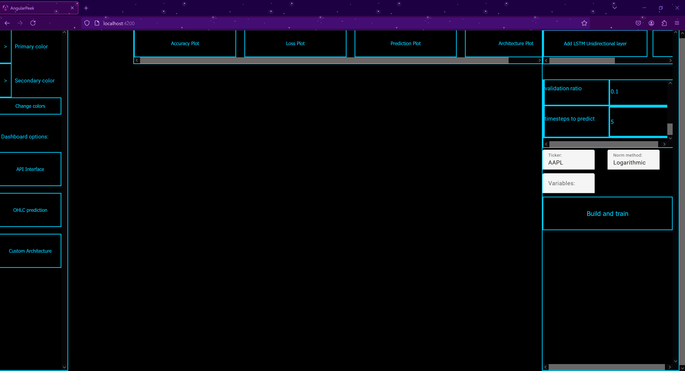
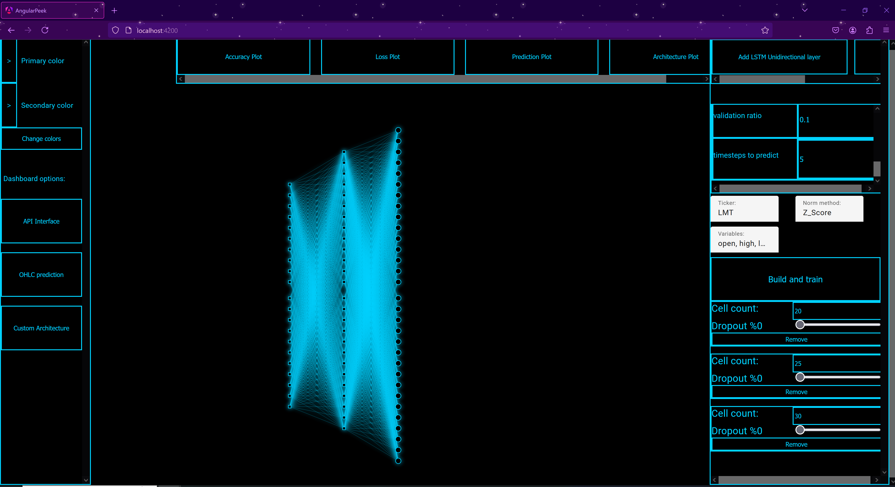

# Peek a browser-based GUI


## What is the goal of this project?
This project's end-goal is to be a technical analysis tool for stock analysis using machine learning, statistical methods, and experimental quantum finance algorithms to help traders make well-informed decisions on the stock they are looking to buy/sell. This tool will be able to gather, process, and manipulate stock data for tasks ranging from machine learning / linear regression based forecasting to technical indicators and portfolio optimization. Some future functionalities will include:


- LSTM based forecasting
- VAE based anomaly detection
- Statistical measurements like mean, mode, standard deviation, ect
- Technical indicators like MACD
- Quantum risk management algorithms like QAOA
- Quantum/Classic machine learning hybrids like QSVM's
- Fully interactable charts for candlesticks, individual variable analysis, and technical indicators


## Prerequisites
Since this project is built out of Python and Angular using Node and Angular's CLI V19, you are going to need `Python 3.1.5` and `Node.js v22.5.1` installed to continue alongside their respective package managers, pip and npm. There are also external dependencies that need to be installed on both sides:


### Python:
#### (Torches actual version is 2.2.2+cu118)
```
pip3 install Torch==2.2.2
pip3 install numpy==1.24.3
pip3 install pandas==1.5.3
pip3 install flask==3.0.3
```
### Node:
```
npm install -g @angular/cli@latest
cd ./AngularPeek
npm install
```
## How do I launch the application?
If you are Windows there are two batch files called `StartAPI.bat` and `StartApp.bat`, launch them both and when Angular is ready it will pop a new tab with the application. If you are on Linux or MAC the three commands to start the app are `python API.py` and `ng serve`


## Using the API Interface
This dashboard controls which tickers are downloaded, the date range, and the time interval of the dataset. The only interactable element here is the candlestick chart rendered in the center of the dashboard with X axis scrolling. 


## Machine Learning
There are currently two options for machine learning, the first is a prebuilt LSTM for predicting OHLC prices with a pretty simple layout:

Hyperparameters are laid out below the ticker and normalization method dropdown controlling:
- epochs
- batch size
- window size
- cell count
- training, testing, and validaton split ratios

The second option is building a model yourself in the Custom Architecture dashboard. This dashboard has the same set of controllable hyperparameters previously mentioned ontop of buttons sequentially adding LSTM or Dense layers to your architecture:

When adding layers, the changes will be reflected in the SVG container at the center of the page populating a LSTM or Dense layer. Alongside the SVG a individual layer controller will be added below the Build and train button allowing you to control Dropout, cell count for the individual layer, and to remove the layer from the architecture:

<video src="public/CML_3.mp4" controls></video>
From here you can alter the machine learning network further and experiment with different combinations or build and train the model. The architecture you constructed will be compiled into a PyTorch model and put through training, to tell when the network is training/done training a asynconous animation will play inverting the colors of the architecture in and out while training: 
<video src="public/CML4.mp4" controls></video>
When training is complete you can view the prediction, accuracy, or loss plots:
<video src="public/CML5.mp4" controls></video>