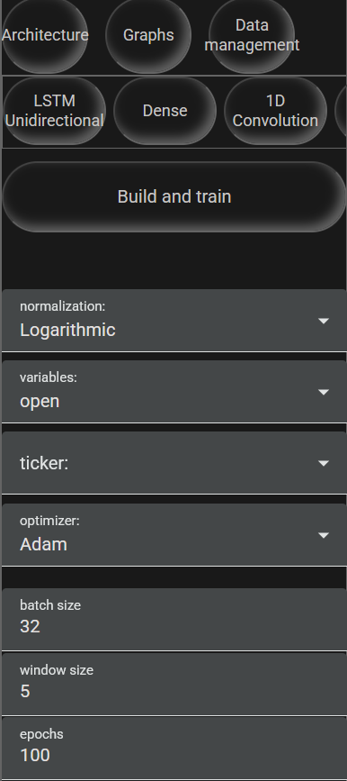
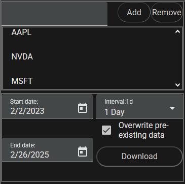
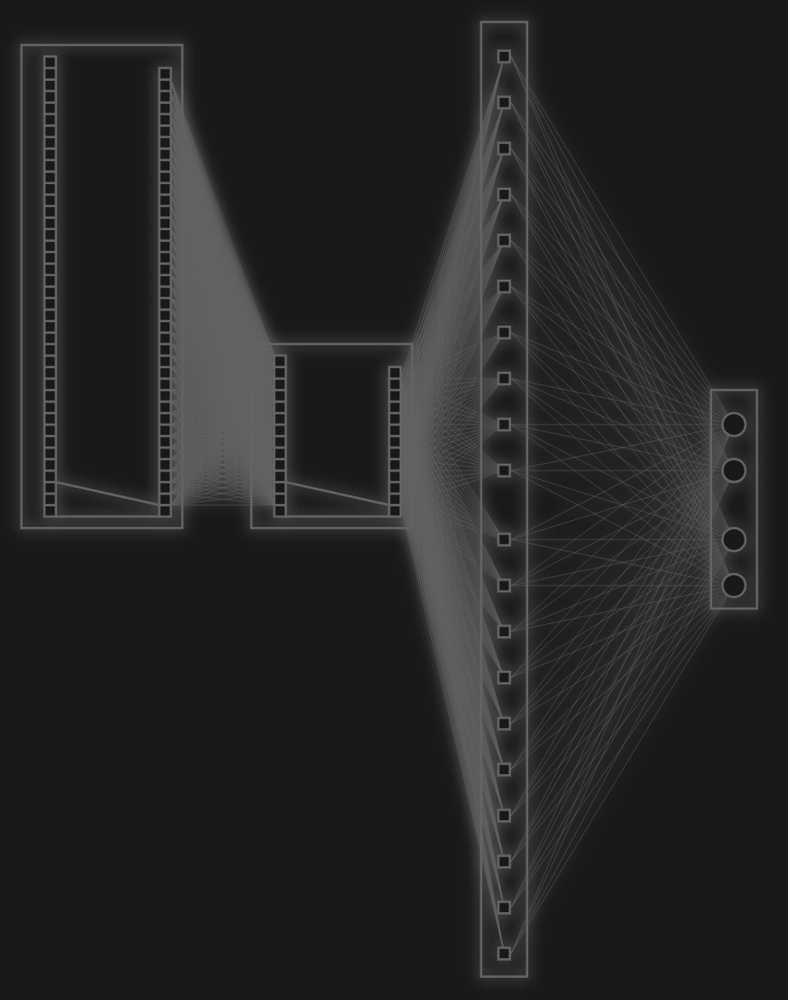

# Peek a browser-based GUI


Peek is a web-based UI for machine learning predictions on stock data. This project aims to provide a robust interactable toolset for forecasting and analyzing stock data through machine learning and statistical methods. Currently this project supports the following:


#### Layers:
- LSTM Unidirectional
- 1D convolution
- 1D max pooling
- Linear/Dense


#### Hyperparameters:
- Normalization method
- Variables being predicted
- Stock ticker being forecasted
- Optimization algorithm
- Batch size
- Window size
- Epochs
- Learning rate
- Training, testing, and validation split ratio
- Prediction steps
- Cell count (any layer)
- Dropout (LSTM and Linear)
- Activation function (LSTM and Linear)
- Kernel size (1D convolution and 1D max pooling)
- Filters (1D convolution and 1D max pooling)
- Stride (1D convolution and 1D max pooling)
- Padding (1D convolution and 1D max pooling)
- Dilation (1D convolution and 1D max pooling)

#### Graphs
- Model accuracy
- Model loss
- Model prediction
- Architecture SVG

## Prerequisites
Since this project is built out of Python and Angular using Node and Angular CLI V19, you are going to need `Python 3.1.5` and `Node.js v22.5.1` installed to continue alongside their respective package managers, pip and npm. There are also external dependencies that need to be installed on both sides:


### Python:
#### (Torches actual version is 2.2.2+cu118)
```
pip3 install Torch==2.2.2
pip3 install numpy==1.24.3
pip3 install pandas==1.5.3
pip3 install flask==3.0.3
```
### Node:
```
npm install -g @angular/cli@latest
cd ./AngularPeek
npm install
```
## How do I launch the application?
If you are Windows there are two batch files called `StartAPI.bat` and `StartApp.bat`, launch them both and when Angular is ready it will pop a new tab with the application. If you are on Linux or MAC the two commands to start the app are `python API.py` and `ng serve`

## Navigation
There are three buttons at the top right of the UI each taking you to the architecture constructor, available graphs, and data management respectively. 



## Data management
On a fresh install there won't be any JSON files containing market data to provide to a custom architecture. So to get started type in the ticker of the stock you want to forecast, click add/remove, and it will be added to / removed from a  que of tickers that will be downloaded. Below you will need to specify a starting and ending date through the two callendars on the bottom left and the type of interval in minutes, hours, days, etc, additionally, optionally, you can select/deselect a checkbox that will replace any pre-existing data for any ticker in the que. 




## Architecture
Below the navigation tabs there are a few buttons to add layers to your architecture, layers are added sequentially so when clicking a button it will append the chosen layer to the end of the network. Below that there is a column of general hyperparameters controlling everything listed previously above, for layer specific parameters you can click within the box the layer cells are contained in and it will pull up a window containing each respective layer's parameters. Whenever you have created and tuned a network, to make a prediction click the build and train button below the add layer buttons and wait for training to complete. When finished a new loss, accuracy, and prediction plot will become available under the graph tab.


### Hybrid network example: 1D convolution -> 1D max pooling -> LSTM -> Dense



### Considerations
With any machine learning task the internal details of your architecture changes with the type of problem and data provided. Since the builder only has forecasting capabilities, the problem is going to be forecasting n variables. For forecasting n variables here are a few things to consider when creating a new architecture:


- If you have a dense layer make the number of cells (output) equal to the number of variables (if open, high and low are selected the cell count should be 3)


- If you have a 1D convolution layer feeding into another 1D convolution or 1D pooling layer then make sure the cell count for the next layer is equal to the output of the previous layer (the featuremap size).


- If predictions become flat especially when using standalone LSTM/LSTM-Dense networks it could be due to window size being too small. The network can be treated like a moving average since it has a similar 'moving' effect.