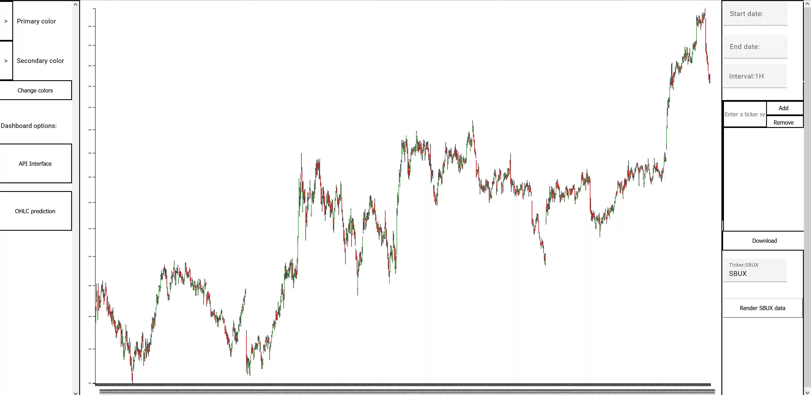
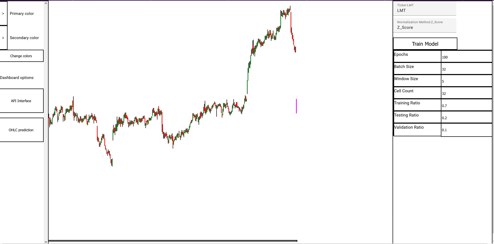

# Peek a Angular Technical Analysis Tool


## What is the goal of this project?
This project's end-goal is to be a technical analysis tool for stock analysis using machine learning, statistical methods, and experimental quantum finance algorithms to help traders make well-informed decisions on the stock they are looking to buy/sell. This tool will be able to gather, process, and manipulate stock data for tasks ranging from machine learning / linear regression based forecasting to technical indicators and portfolio optimization. Some future functionalities will include:


- LSTM based forecasting
- VAE based anomaly detection
- Statistical measurements like mean, mode, standard deviation, ect
- Technical indicators like MACD
- Quantum risk management algorithms like QAOA
- Quantum/Classic machine learning hybrids like QSVM's
- Fully interactable charts for candlesticks, individual variable analysis, and technical indicators


## Prerequisites
Since this project is built out of Python and Angular using Node and Angular's CLI V19, you are going to need `Python 3.1.5` and `Node.js v22.5.1` installed to continue alongside their respective package managers, pip and npm. There are also external dependencies that need to be installed on both sides:


### Python:
#### (Torches actual version is 2.2.2+cu118)
```
pip3 install Torch==2.2.2
pip3 install statsmodels==0.14.0
pip3 install numpy==1.24.3
pip3 install pandas==1.5.3
pip3 install matplotlib==3.7.1
pip3 install qiskit==0.45.0
pip3 install qiskit_algorithms==0.3.0
pip3 install qiskit_finance==0.4.1
pip3 install flask==3.0.3
pip3 install flask_cors==4.0.1
pip3 install qiskit_aer==0.12.0
pip3 install pylatexenc==2.10
```
### Node:
```
npm install -g @angular/cli@latest
cd ./AngularPeek
npm install
```
## How do I launch the application?
If you are Windows there are two batch files called `StartAPI.bat` and `StartApp.bat`, launch them both and when Angular is ready it will pop a new tab with the application. If you are on Linux or MAC the three commands to start the app are `python API.py` and `ng serve`


## Using the API Interface
This dashboard controls which tickers are downloaded, the date range, and the time interval of the dataset. The only interactable element here is the candlestick chart rendered in the center of the dashboard with X axis scrolling. 


## Using Machine Learning
As of now there is only a LSTM predicting OHLC prices and outputs the resulting OHLC prdiction at the end of the candlestick chart. Hyperparameters can be tuned on the left hand side alongside the ticker's data that will be loaded and passed to the LSTM.

